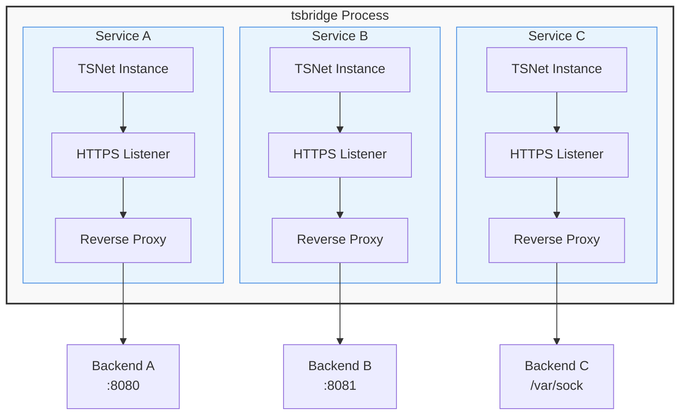

# tsbridge

A lightweight proxy manager built on Tailscale's tsnet library that enables multiple HTTPS services on a Tailnet via a single TOML configuration file.

> **Security Note**: tsbridge is designed for use in relatively trusted environments like home labs and development networks. It is not intended for security-critical production deployments. See [THREAT_MODEL.md](THREAT_MODEL.md) for details.

## Features

- **Single Binary**: Easy deployment with no external dependencies
- **Multi-Service Support**: Run multiple named services from one process
- **Automatic HTTPS**: TLS certificates managed automatically by Tailscale
- **Certificate Priming**: Automatic TLS certificate provisioning on startup to avoid delays
- **Flexible Backends**: Proxy to TCP ports or Unix sockets
- **Identity Headers**: Optional Tailscale identity header injection
- **Observability**: Built-in Prometheus metrics and structured logging
- **Graceful Shutdown**: Zero-downtime deployments with configurable timeouts
- **Per-Service Config**: Override global settings for individual services
- **Docker Label Config**: Dynamic configuration from Docker labels (similar to Traefik)

## Quick Start

### Installation

Download the latest binary from [releases](https://github.com/jtdowney/tsbridge/releases) or build from source:

```bash
go install github.com/jtdowney/tsbridge/cmd/tsbridge@latest
```

### Basic Configuration

Create a `tsbridge.toml` file:

```toml
# Tailscale OAuth configuration
[tailscale]
oauth_client_id_env = "TS_OAUTH_CLIENT_ID"
oauth_client_secret_env = "TS_OAUTH_CLIENT_SECRET"
# OAuth tags are REQUIRED when using OAuth authentication
oauth_tags = ["tag:server", "tag:proxy"]
state_dir = "/var/lib/tsbridge"

# Global defaults for all services
[global]
read_header_timeout = "30s"
write_timeout = "30s"
metrics_addr = ":9090"

# Define your services
[[services]]
name = "api"
backend_addr = "127.0.0.1:8080"
whois_enabled = true

[[services]]
name = "web"
backend_addr = "unix:///var/run/web.sock"
```

### Running tsbridge

```bash
# Set OAuth credentials
export TS_OAUTH_CLIENT_ID="your-client-id"
export TS_OAUTH_CLIENT_SECRET="your-client-secret"

# Run tsbridge
tsbridge -config tsbridge.toml
```

Your services will be available at:

- `https://api.<your-tailnet-name>.ts.net`
- `https://web.<your-tailnet-name>.ts.net`

## Streaming Services

tsbridge supports long-lived streaming connections such as media streaming, Server-Sent Events (SSE), and real-time data feeds. Proper configuration is essential for these services to work correctly.

### Key Configuration Options

- **`flush_interval`**: Controls response buffering
  - `-1ms`: Immediate flushing (no buffering) - recommended for streaming
  - `100ms`: Flush every 100ms - good for periodic updates
  - Not set: Default buffering for performance
  
- **`write_timeout`**: Controls connection lifetime
  - `0s`: No timeout - allows indefinite streaming
  - `30s` (default): Connections terminate after 30 seconds
  
### Example: Media Streaming Service

```toml
[[services]]
name = "jellyfin"
backend_addr = "localhost:8096"
write_timeout = "0s"      # Allow indefinite streaming
flush_interval = "-1ms"   # Immediate flushing for smooth playback
idle_timeout = "300s"     # Keep connections alive for 5 minutes
```

### Example: Server-Sent Events (SSE)

```toml
[[services]]
name = "events"
backend_addr = "localhost:3000"
write_timeout = "0s"      # SSE connections stay open
flush_interval = "-1ms"   # Real-time event delivery
```

For detailed streaming configuration and troubleshooting, see [docs/configuration.md#streaming-services-configuration](docs/configuration.md#streaming-services-configuration).

## Architecture



Each service runs its own TSNet instance with isolated state, enabling:

- Independent service lifecycle management
- Separate TLS certificate handling
- Isolated authentication and authorization
- Per-service configuration and timeouts

## Configuration

tsbridge uses a TOML configuration file with three main sections:

### Tailscale Configuration

```toml
[tailscale]
# OAuth credentials (choose one method)
oauth_client_id = "direct-value"
oauth_client_id_env = "ENV_VAR_NAME"
oauth_client_id_file = "/path/to/file"

oauth_client_secret = "direct-value"
oauth_client_secret_env = "ENV_VAR_NAME"
oauth_client_secret_file = "/path/to/file"

# Optional: Auth key for non-OAuth authentication
auth_key = "tskey-auth-..."
auth_key_env = "TS_AUTH_KEY"
auth_key_file = "/path/to/authkey"

# State directory for TSNet data
state_dir = "/var/lib/tsbridge"
state_dir_env = "TSBRIDGE_STATE_DIR"

# Optional: OAuth tags (required when using OAuth authentication)
oauth_tags = ["tag:proxy", "tag:production"]
```

### Global Defaults

```toml
[global]
# Timeouts (Go duration format)
read_header_timeout = "30s"
write_timeout = "30s"
idle_timeout = "120s"
shutdown_timeout = "15s"


# Whois lookup timeout
whois_timeout = "1s"

# Metrics endpoint (optional)
metrics_addr = ":9090"

# Access logging
access_log = true
```

### Service Definitions

```toml
[[services]]
name = "api"                          # Unique service name
backend_addr = "127.0.0.1:8080"      # Backend address (TCP or Unix socket)
whois_enabled = true                 # Inject Tailscale identity headers
whois_timeout = "500ms"              # Override global whois timeout

# Override global settings for this service
read_header_timeout = "60s"
write_timeout = "60s"
access_log = false

# Add security headers to downstream responses
downstream_headers = { "Strict-Transport-Security" = "max-age=31536000; includeSubDomains" }
```

For a complete configuration reference, see [docs/configuration.md](docs/configuration.md).

## Deployment

### Systemd

See [deployments/systemd/](deployments/systemd/) for systemd service files and installation instructions.

### Docker

#### With TOML Configuration

```bash
docker run -v /path/to/config:/config \
  -v tsbridge-state:/var/lib/tsbridge \
  -e TS_OAUTH_CLIENT_ID=your-id \
  -e TS_OAUTH_CLIENT_SECRET=your-secret \
  ghcr.io/jtdowney/tsbridge:latest \
  -config /config/tsbridge.toml
```

#### With Docker Labels (Dynamic Configuration)

```yaml
services:
  tsbridge:
    image: ghcr.io/jtdowney/tsbridge:latest
    command: ["--provider", "docker"]
    environment:
      - TS_OAUTH_CLIENT_ID=${TS_OAUTH_CLIENT_ID}
      - TS_OAUTH_CLIENT_SECRET=${TS_OAUTH_CLIENT_SECRET}
    volumes:
      - /var/run/docker.sock:/var/run/docker.sock:ro
      - tsbridge-state:/var/lib/tsbridge
    labels:
      - "tsbridge.tailscale.oauth_client_id_env=TS_OAUTH_CLIENT_ID"
      - "tsbridge.tailscale.oauth_client_secret_env=TS_OAUTH_CLIENT_SECRET"
      - "tsbridge.tailscale.oauth_tags=tag:server"  # Required when using OAuth
      - "tsbridge.tailscale.state_dir=/var/lib/tsbridge"
      - "tsbridge.global.metrics_addr=:9090"
    ports:
      - "9090:9090"  # Metrics port

  myapp:
    image: myapp:latest
    labels:
      - "tsbridge.enabled=true"
      - "tsbridge.service.name=myapp"
      - "tsbridge.service.port=8080"

volumes:
  tsbridge-state:
```

See [docs/docker-labels.md](docs/docker-labels.md) for complete Docker label configuration reference.

## Monitoring

### Prometheus Metrics

When `metrics_addr` is configured, tsbridge exposes metrics at `/metrics`:

- `tsbridge_requests_total` - Total HTTP requests by service and status
- `tsbridge_request_duration_seconds` - Request latency histogram
- `tsbridge_errors_total` - Error counts by service and type
- `tsbridge_active_connections` - Currently active connections
- `tsbridge_backend_connections_total` - Backend connection attempts
- `tsbridge_whois_duration_seconds` - Whois lookup latency
- `tsbridge_connection_pool_active` - Active requests per service (tracks in-flight requests to backends)
- `tsbridge_connection_pool_idle` - Idle connections (always 0, reserved for future use)
- `tsbridge_connection_pool_wait` - Requests waiting for connection (always 0, reserved for future use)

### Logging

tsbridge logs to stdout in plain text format:

```
2024-01-15 10:30:45 INFO service=api msg="starting service" backend=127.0.0.1:8080
2024-01-15 10:30:46 INFO service=api msg="listener ready" addr=api.example.ts.net:443
```

Enable debug logging with `-verbose` flag.

## Development

### Prerequisites

- Go 1.24 or later
- Make (optional, for convenience targets)

### Building

```bash
# Build binary
make build

# Run tests
make test

# Run linters
make lint

# Build for all platforms
make release
```

### Running Tests

```bash
# Run tests
go test ./...

# With coverage
go test -cover ./...
```

## License

MIT License - see [LICENSE](LICENSE) file for details.

## Acknowledgments

- Built with [Tailscale](https://tailscale.com)'s excellent [tsnet](https://pkg.go.dev/tailscale.com/tsnet) library
- Inspired by [tsnsrv](https://github.com/boinkor-net/tsnsrv) - a similar tool for exposing services on a Tailnet
