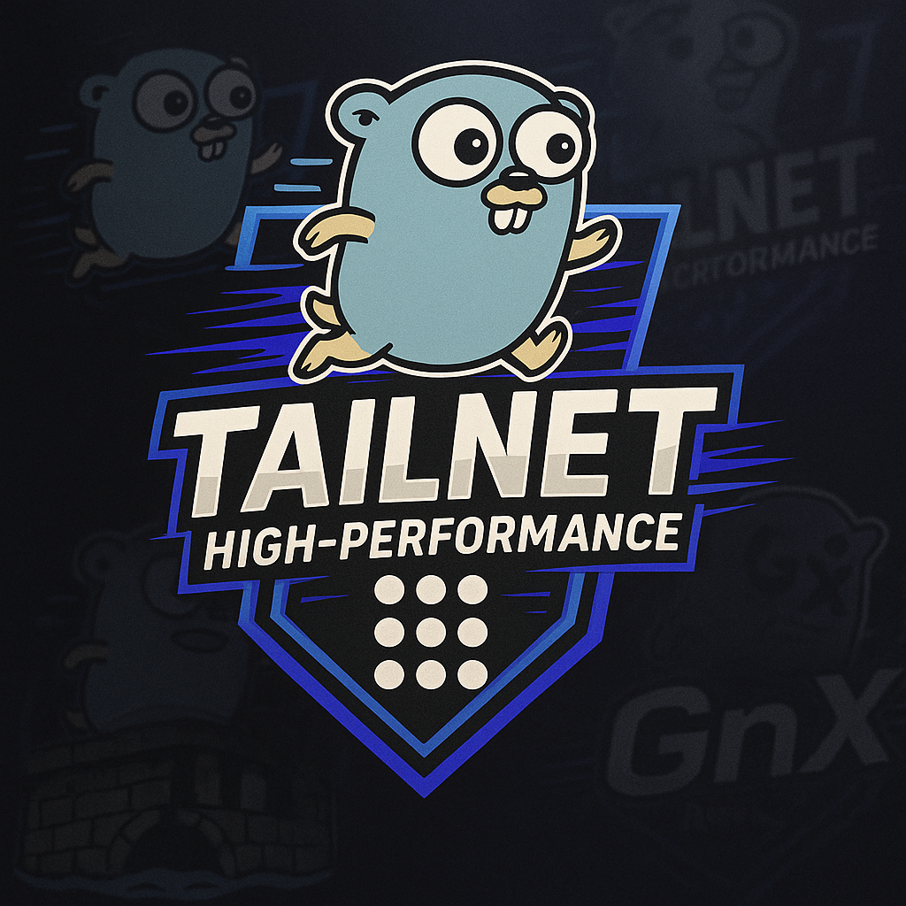

# tailnet

[](https://github.com/sudosu404/tailnet-cli/releases)
[](https://github.com/sudosu404/tailnet-cli/actions)
[](https://goreportcard.com/report/github.com/sudosu404/tailnet-cli)
[](https://github.com/sudosu404/tailnet-cli/blob/main/LICENSE)



tailnet acts as a tsnet-powered reverse proxy, letting you expose multiple backend services on your Tailnet from a single process. It's designed for homelabs and development environments where you want the magic of Tailscale without the hassle of running a separate sidecar for every service.

Inspired by Traefik, tailnet can be configured with a simple TOML file or by watching Docker for container labels.

## Why?

I got tired of spinning up a new [tsnsrv](https://github.com/boinkor-net/tsnsrv) instance for every service I wanted to expose on my Tailnet. Each one needs its own systemd service and configuration. With tailnet, you configure once and add services as needed - either through a config file or by just adding labels to your Docker containers.

## Install

Grab a binary from [releases](https://github.com/sudosu404/tailnet-cli/releases) or:

```bash
go install github.com/sudosu404/tailnet-cli/cmd/tailnet@latest
```

## Quick start

1. Get OAuth credentials from <https://login.tailscale.com/admin/settings/oauth>
2. Create `tailnet.toml`:

```toml
[tailscale]
oauth_client_id_env = "TS_OAUTH_CLIENT_ID"
oauth_client_secret_env = "TS_OAUTH_CLIENT_SECRET"

[[services]]
name = "api"
backend_addr = "127.0.0.1:8080"

[[services]]
name = "web"
backend_addr = "unix:///var/run/web.sock"
```

3. Run it:

```bash
export TS_OAUTH_CLIENT_ID=your-id
export TS_OAUTH_CLIENT_SECRET=your-secret
tailnet -config tailnet.toml
```

tailnet will now be available on your tailnet. Thanks to MagicDNS, you can reach your services at `https://api.<tailnet>.ts.net` and `https://web.<tailnet>.ts.net`.

## Configuration

tailnet is configured via `tailnet.toml`. See [docs/quickstart.md](docs/quickstart.md) for getting started quickly, or [docs/configuration-reference.md](docs/configuration-reference.md) for all options.

Here are a few common settings:

- `whois_enabled`: Set to `true` to add `Tailscale-User-*` identity headers to upstream requests
- `write_timeout`: Defaults to `30s`. Set to `"0s"` to support long-running connections like Server-Sent Events (SSE)
- `metrics_addr`: Expose a Prometheus metrics endpoint (e.g., `":9090"`) - see [docs/metrics.md](docs/metrics.md) for available metrics (secure this endpoint in production)

### Security

> **Security Note**: tailnet is intended for homelabs and development environments. It hasn't been hardened or battle-tested for production workloads. See [THREAT_MODEL.md](THREAT_MODEL.md) for details.

For enhanced security using tag ownership, see [Tag Ownership and OAuth Security](docs/configuration-reference.md#tag-ownership-and-oauth-security).

## Docker

### Static config

```bash
docker run -v /path/to/config:/config \
  -e TS_OAUTH_CLIENT_ID=... \
  -e TS_OAUTH_CLIENT_SECRET=... \
  ghcr.io/sudosu404/tailnet-cli:latest -config /config/tailnet.toml
```

### Dynamic with labels (like Traefik)

tailnet can watch Docker and automatically expose containers based on their labels:

```yaml
# docker-compose.yml
services:
  tailnet:
    image: ghcr.io/sudosu404/tailnet-cli:latest
    command: ["--provider", "docker"]
    volumes:
      - /var/run/docker.sock:/var/run/docker.sock # Required for label discovery
      - tailnet-state:/var/lib/tailnet
    environment:
      - TS_OAUTH_CLIENT_ID=${TS_OAUTH_CLIENT_ID}
      - TS_OAUTH_CLIENT_SECRET=${TS_OAUTH_CLIENT_SECRET}
    labels:
      - "tailnet.tailscale.oauth_client_id_env=TS_OAUTH_CLIENT_ID"
      - "tailnet.tailscale.oauth_client_secret_env=TS_OAUTH_CLIENT_SECRET"
      - "tailnet.tailscale.state_dir=/var/lib/tailnet"
      - "tailnet.tailscale.default_tags=tag:server" # Must match or be owned by your OAuth client's tag

  whoami:
    image: traefik/whoami
    labels:
      - "tailnet.enabled=true"
      - "tailnet.service.name=whoami"
      - "tailnet.service.port=80"

volumes:
  tailnet-state:
```

See [docs/docker-labels.md](docs/docker-labels.md) for the full label reference.

> **Note**: The `default_tags` must match or be owned by your OAuth client's tag. Individual services can override this with their own `tags` label. See [Tag Ownership and OAuth Security](docs/configuration-reference.md#tag-ownership-and-oauth-security) for setup details.

## Headscale

Works with [Headscale](https://headscale.net/) but requires auth keys instead of OAuth and TLS must be disabled (until [headscale issue #2137](https://github.com/juanfont/headscale/issues/2137) gets implemented):

```toml
[tailscale]
auth_key_env = "TS_AUTH_KEY"
control_url = "https://headscale.example.com"

[[services]]
name = "api"
backend_addr = "127.0.0.1:8080"
tls_mode = "off"  # Required for Headscale
```

See [example/headscale/](example/headscale/) for a complete setup.

## Development

```bash
make build  # Build binary
make test   # Run tests
make lint   # Run linters
```

## Monitoring

When `metrics_addr` is configured, tailnet exposes Prometheus metrics at `http://<metrics_addr>`:

- Request counts and latencies
- Error rates
- Active connections
- Service lifecycle events

## Architecture

Each service runs its own tsnet instance with isolated state, enabling independent lifecycle management and per-service configuration.

## Prior Art

- [tsnsrv](https://github.com/boinkor-net/tsnsrv) - Inspiration but single service focused
- [tsdproxy](https://github.com/almeidapaulopt/tsdproxy) - Docker-specific

## License

MIT License - see [LICENSE](LICENSE) file for details.
